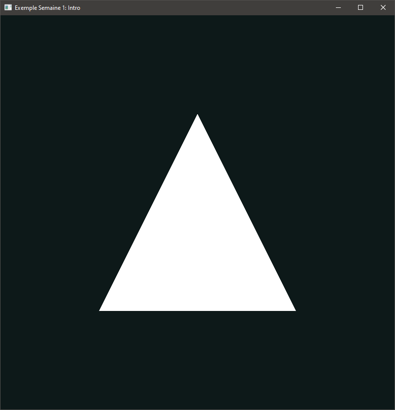
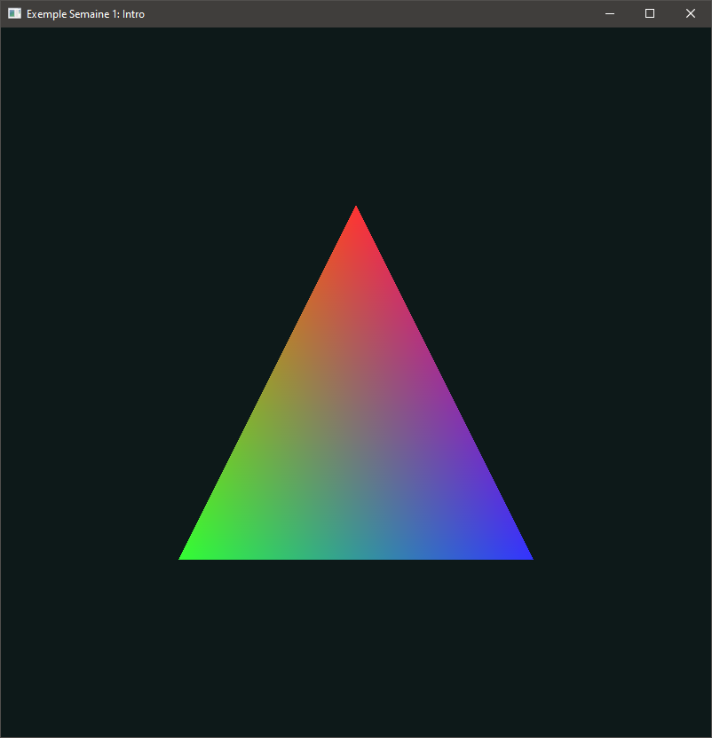
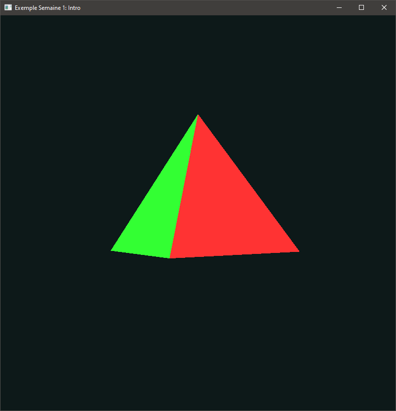

# Introduction et premiers pas

N.B. : Cet exemple est fait en utilisant du vieux OpenGL. Pour le reste de la session, on va plutôt faire du OpenGL moderne.

Dans le `main`, on fait d'abord la création de la fenêtre et l'initialisation du contexte OpenGL. C'est ce qui nous permet ensuite de faire nos affichages. On fait ensuite les manipulations pour que l'affichage soit bien cadré dans la fenêtre (les détails n'importent pas pour tout de suite).

La boucle principale s'exécute jusqu'à la fermeture de la fenêtre. On efface d'abord ce qu'il y a dans les tampons. Ça réinitialise la trame à la couleur de fond choisie avec `glClearColor`. Une rotation continue est appliquée pour que la forme dessinée tourne sur elle-même. On dessine ensuite une forme : un triangle blanc, un triangle coloré ou une pyramide colorée. Vous pouvez commenter/décommenter les lignes pour tester chaque affichage.

Dans tous les cas, notez l'ordre de dessin des sommets des faces. En effet, par défaut on veut que les faces extérieures soient les faces *avant*, qui sont par défaut les faces dessinées en ordre antihoraire par rapport à l'observateur (donc sur la fenêtre).

La fonction `drawWhiteTriangle` affiche ceci :

`drawColoredTriangle` :

`drawPyramid` :

