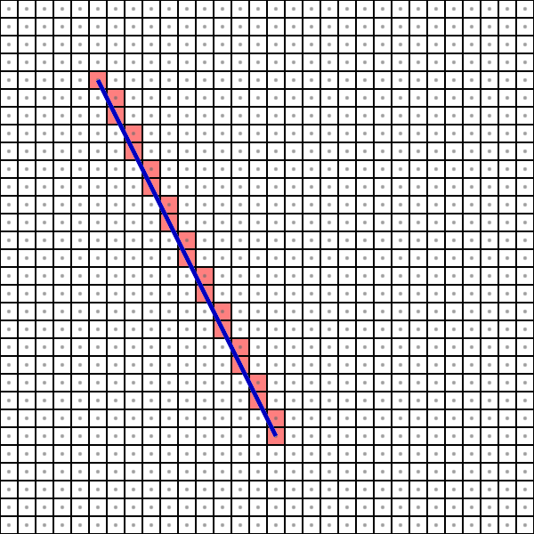

# Algorithmes de création de fragments

Simple exemple pour illustrer les algorithmes de rastérisation, c'est-à-dire trouver les fragments qui sont *allumés* par une ligne ou courbe. On peut illustrer les segment de droite, c-à-d partant d'un pixel à un autre ou les cercle, c-à-d sur un rayon autour d'un pixel.

Dans les exemples, on simule une grille de pixels blancs. La forme à rastériser est dessinée en bleu comme référence, et les fragments créés (les pixels remplis par la forme) sont en rouge.

Dans le code, `fillLineFragmentsIncremental` crée les fragments en faisant un affichage incrémental initial, qui utilise des réels. Cet algorithme n'est pas particulièrement efficace (utilisation de point flottant) et la fonction ne traite pas les symétries. Sans traiter les symétrie, l'algo de base ne fonctionne que pour une pente entre 0 et 1 et un deuxième point à gauche du premier.

`fillLineFragmentsBresenham` utilise l'algorithme de Bresenham (point milieu) qui est très efficace en utilisant que des valeurs et opérations entières. Dans cette fonction, on traite aussi les symétrie qui permettent tous les cas de segments de droite.

* Si le deuxième point est à gauche du premier, on inverse l'ordre des points.
* Si la pente est > 1, on balaye par rapport à y plutôt que x, donc on fait à semblant que les x sont des y et vice-versa.
* Si la pente est négative, on allume le fragment au sud-est plutôt qu'au nord-est.

`fillCircleFragments` allume les fragments pour un cercle qui d'un certain rayon (en pixels) autour d'un pixel donné. L'algorithme de base qui est implémenté allume seulement les fragments pour l'octant Nord-Nord-Est. Cependant, un cercle est nécessairement symétrique sur tous ces octants, donc pour chaque fragment, on allume aussi les 8 symétries.

## Contrôles

* F5 : capture d'écran.
* 1 : droite où m = 0
* 2 : droite où 0 < m < 1
* 3 : droite où m = 1
* 4 : droite où m > 1
* 5 : droite où -1 < m < 0
* 6 : droite où m = -1
* 7 : droite où m < -1
* 8 : droite où x1 > x2, 0 < m < 1
* 9 : droite où x1 > x2, m < -1
* C : changer entre les exemples de cercles et de droites.
* B : utiliser l'algo de Bresenham (avec entiers et symétries) ou incrémental (avec des réels).
