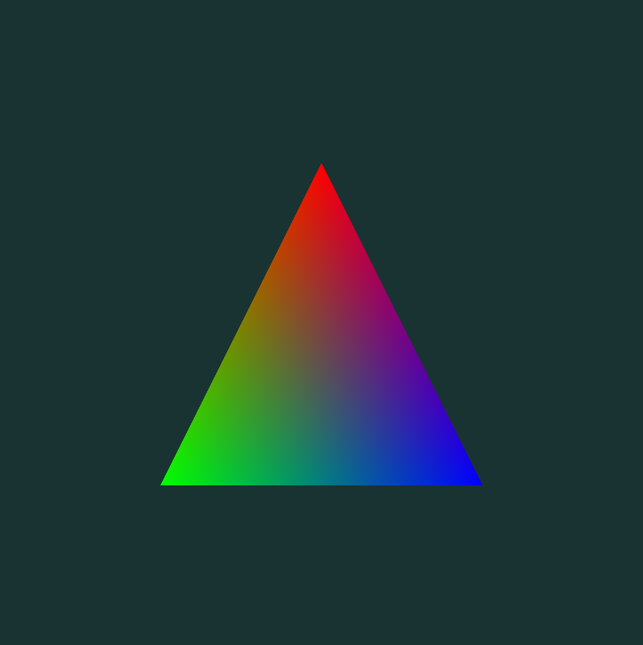

# Exemple Ex02_Base

Dans cet exemple, on affiche simplement un triangle coloré à l'écran.

Pour ce faire (dans la fonction *main* de [main.cpp](main.cpp)) on charge les données des sommets une fois avant la boucle d'exécution, puis à chaque trame on fait le dessin et le rafraîchissement de la fenêtre.

On a trois composantes de position (*xyz*) pour chaque sommet, et trois sommets, donc 9 *float* pour les positions. On a 4 composantes de couleur (*rgba*) par sommet, donc 12 *float* pour les couleurs.
