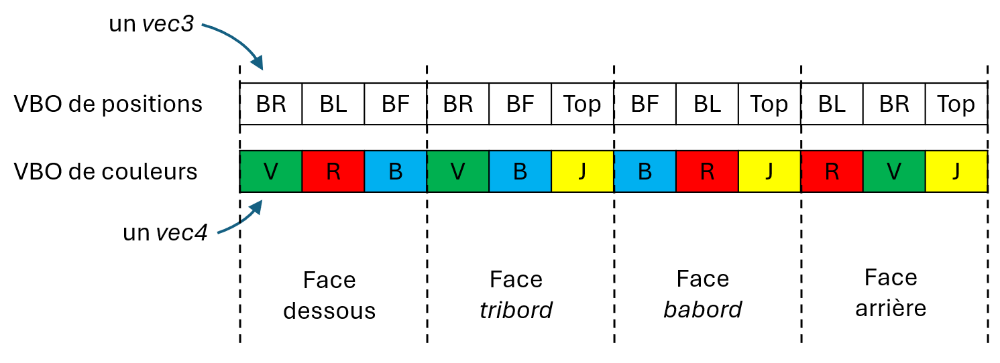
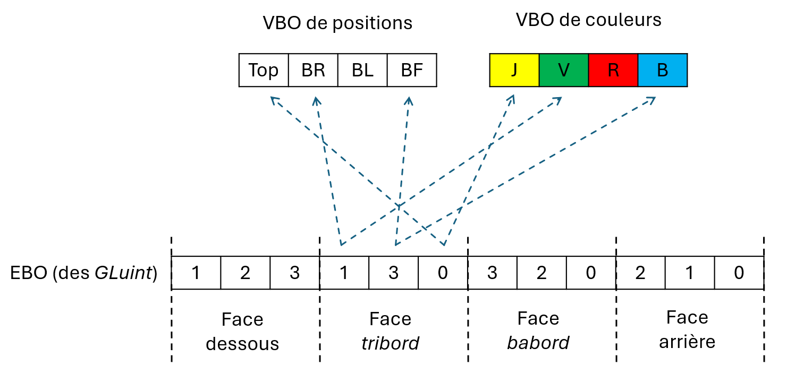

# Pipeline graphique programmable, objets et nuanceurs

## Encapsulation de la gestion de fenêtre

D'abord, on a encapsulé l'exécution de notre programme OpenGL dans la classe `OpenGLApplication` ([OpenGLApplication.hpp](../inf2705/OpenGLApplication.hpp)). Ça inclue beaucoup de fonctionnalités comme la gestion de fenêtre et d'événements, mais aussi la capture de trame (des *screenshot*).

Pour créer une application, il faut en hériter, puis redéfinir les méthodes `init` (appelée avant la première trame.) et `drawFrame` (appelée à chaque trame), puis appeler `run` dans le `main` qui part et gère la boucle d'exécution. Ça simplifie le code pour le reste de la session.

## Tampons de données de sommets (VBO et EBO)

On charge d'abord les données de la pyramide. On fait ça une fois dans le `init`, donc avant la première trame.

Voici de quoi a l'air la pyramide avec ses positions dans l'espace :

Chaque sommet a une position et une couleur. On peut aussi choisir de mettre les données de la pyramide au complet VBO face par face dans le VBO (donc en répétant les sommets partagés), ou de façon unique en utilisant un tableau de connectivité (un *Element Buffer Object* ou EBO). La variable `usingElements` dans le code contrôle quel façon de faire est utilisée.

Si on charge les données de la pyramide au complet pour faire un appel à `glDrawArrays`, on aura 4 faces de 3 sommets chacunes, donc 12 positions et 12 couleurs. Dans la figure ci-dessous, *BR*, *BL*, *BF* et *Top* font référence aux positions dans la figure précédente.

On remarque qu'on répète les valeurs pour les sommets qui sont partagés entre les faces. On peut aussi charger les données sans répétition dans les VBo et avoir un tableau de connectivité dans un EBO. On fera alors un appel à `glDrawElements`. Dans la figure ci-dessous, on peut voir la connectivité (avec les flèches pour la face tribord).

Au lieu d'avoir deux VBO séparés pour les positions et couleurs, on peut les combiner dans un seul VBO (la structure `VertexData`). La variable `usingSingleDataBuffer` dans le code contrôle ceci. La structure `VertexData` combine les deux données. Il faut alors spécifier les décalages dans notre appel à `glVertexAttribPointer` pour configurer où se trouve la position et la couleur dans la *struct*.

## Nuanceurs

On charge le code source des nuanceurs en lisant les fichiers *.glsl* et en passant leur contenu à `glShaderSource`. On compile ensuite avec `glCompileShader` et on l'attache au programme avec `glAttachShader`. Enfin on fait `glLinkProgram` pour lier ensemble les nuanceurs. On voit le parallèle avec compiler du C++ : des *.cpp* qu'on compile séparément (les *unités de compilation*) puis qu'on met ensemble dans l'exécutable à l'édition de lien (le *linking*).

Les variables uniformes sont mises à jour dans la mémoire graphique avec leurs noms.

Le nuanceur de fragment [pyramid_brightness_frag.glsl](pyramid_brightness_frag.glsl) applique un facteur multiplicatif sur la couleur. Ce facteur est la variable uniforme `brightness` qui est incrémentée et mise à chaque trame dans `drawFrame`.
