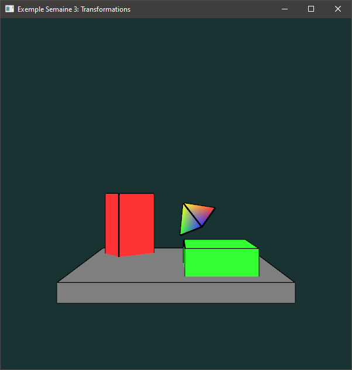
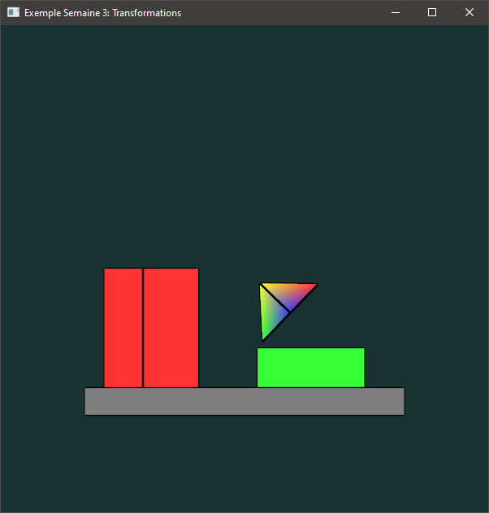

# Pipeline de transformations et matrices

## Encapsulation des VAO, VBO et EBO

Pour le reste de la session, on va encapsuler la gestion des objets comme les VAO, VBO et EBO dans la classe `Mesh` ([Mesh.hpp](../inf2705/Mesh.hpp)). Ça va nous éviter la répétition de code pour le dessin de formes. Un maillage (*mesh*) représente les sommets d'une forme à afficher. Chaque sommet (structure `VertexData`) a une position (référentiel de l'objet), un vecteur normal et des coordonnées de texture. Dans le présent exemple, on va seulement utiliser la position, mais les deux autres sont des informations assez fondamentales.

On utilise la classe `Mesh` en donnant des valeurs à ses sommets (`Mesh::vertices`) et optionnellement à son tableau de connectivité (`Mesh::indices`). On appelle ensuite `setup` qui fait la création du VAO, du VBO et du EBO, remplit les tampons en mémoire et configure les trois attributs.

```c++
// Les données du maillage.
Mesh square;
// Les données de sommets (pos, normale, tex) à mettre dans le VBO.
square.vertices = {
    {{-0.5, -0.5, 0}, {0, 0, -1}, {0, 0}},
    {{ 0.5, -0.5, 0}, {0, 0, -1}, {1, 0}},
    {{ 0.5,  0.5, 0}, {0, 0, -1}, {1, 1}},
    {{-0.5,  0.5, 0}, {0, 0, -1}, {0, 1}},
};
// Le tableau de connectivité à mettre dans le EBO.
square.indices = {
    0, 1, 2,
    0, 2, 3
};
// Config
square.setup();
// Dessin
square.draw(GL_TRIANGLES);
```

## Encapsulation des opérations matricielles

On va aussi encapsuler les opérations matricielles dans la classe TransformStack ([TransformStack.hpp](../inf2705/TransformStack.hpp)). C'est une pile de matrices de transformations (hérite de `std::stack`) et les transformations (rotation, translation, etc.) s'opèrent sur le dessus de la pile. C'est un peu comme la classe `MatricePipeline` des notes de cours.

Méthodes principales de cette classe :

* `top()` : Obtenir la matrice sur le dessus de la pile.
* `push()` : Duppliquer le dessus de la pile.
* `push(m)` : Empiler *m*.
* `pushIdentity()` et `loadIdentity()` : Empiler ou charger une matrice identité.
* `pop()` : Dépiler le dessus de la pile.
* `scale(v)`, `translate(v)`, `rotate(a, v)` : Les transformations usuelles. Notez que les angles sont en degrés.
* `lookAt(oeil, cible, up)` : Même appel qu'avec *glm*.
* `frustum(L, R, B, T, N, F)` : Même appel qu'avec *glm*.
* `perspective(fovy, aspect, proche, loin)` : Même appel qu'avec *glm*, mais l'angle est en degrés.
* Toutes les méthodes de la classe `std::stack`.

## Encapsulation des programmes GLSL

La classe `ShaderProgram` ([ShaderProgram.hpp](../inf2705/ShaderProgram.hpp)) emballe les opérations liées à la compilation de nuanceurs et à la mise à jour de variables uniformes. Ça va encore là nous éviter beaucoup de répétition de code pour la gestion de nuanceurs.

```c++
ShaderProgram prog;
prog.attachSourceFile(GL_VERTEX_SHADER, "un_nuanceur_sommets.glsl");
prog.attachSourceFile(GL_FRAGMENT_SHADER, "un_nuanceur_fragments.glsl");
prog.link();
```

La mise à jour des variables uniformes est aussi plus simple :

```c++
vec4 uniVariable = {1, 0, 0, 1};
TransformStack viewMatrix;
viewMatrix.lookAt({0, 10, 5}, {0, -1, 0}, {0, 1, 0});
prog.use();
prog.setVec("nomDeLaVariable", uniVariable);
prog.setMat("view", viewMatrix);
```

## Objets dans la scène

On a une scène constituée d'un cube gris aplati, un cube vert un peu moins plat, un cube rouge allongé sur sa hauteur et une pyramide multicolore. Le cube rouge tourne sur lui-même (axe des *y*) et la pyramide tourne autour de l'axe des *z* à une certaine distance (un tour de barils, ou *barrel roll*).

La méthode `initCube` fait le chargement d'un cube de côté 2 centré à l'origine. `drawCube` dessine un cube en traçant les arêtes en noir pour mieux illustrer la géométrie. `drawCubeScene` dessine les trois cubes ensembles. Notez qu'on utilise le même maillage pour les trois, ce sont les variables uniformes de matrice de modélisation et de couleur qui changent entre les dessins.

La méthode `initPyramid` charge la pyramide multicolore en mémoire en lui ajoutant un VBO pour ses couleurs par sommet. `drawRotatingPyramid` la dessine en appliquant la transformation appropriée. Les arêtes sont dessinées en noir comme pour les cubes.


## Caméra synthétique et projections

On utilise ici une caméra orbitale, c'est-à-dire qui orbite autour de l'origine. C'est pratique pour observer une scène compacte. La méthode `setupOrbitCamera` met à jour la matrice de visualisation.

La projection perspective (méthode `applyPerspective`) projette les sommets  vers la caméra et semble plus réaliste. Les objets plus éloignés paraissent plus petits et des points de fuite apparaissent.

La projection orthogonale (méthode `applyOrtho`) maintient la taille des objets ainsi que les angles et projète parallèlement vers le plan de projection.

On compare la différence entre perspective et orthogonale dans les deux captures d'écran ci-dessous. La position de la caméra est exactement la même dans les deux captures.





## Contrôles

* F5 : capture d'écran.
* \+ et - : rapprocher et éloigner la caméra orbitale.
* \+ et - avec Shift : réduire/élargir le champs de vision (FOV).
* haut/bas : changer l'élévation ou la latitude de la caméra orbitale.
* gauche/droite : changer la longitude ou le roulement (avec shift) de la caméra orbitale.
* R : Réinitialiser la position de la caméra.
* 1 : Projection perspective.
* 2 : Projection orthogonale.

