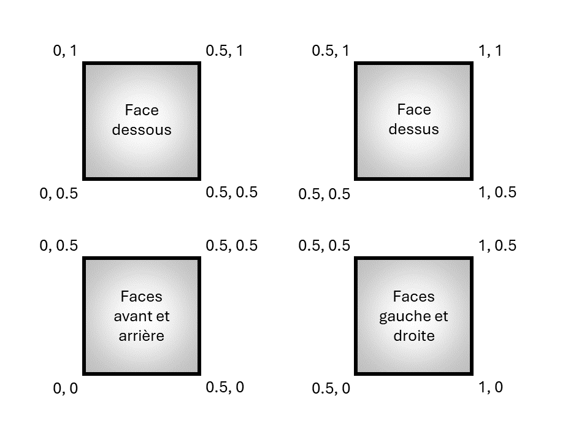
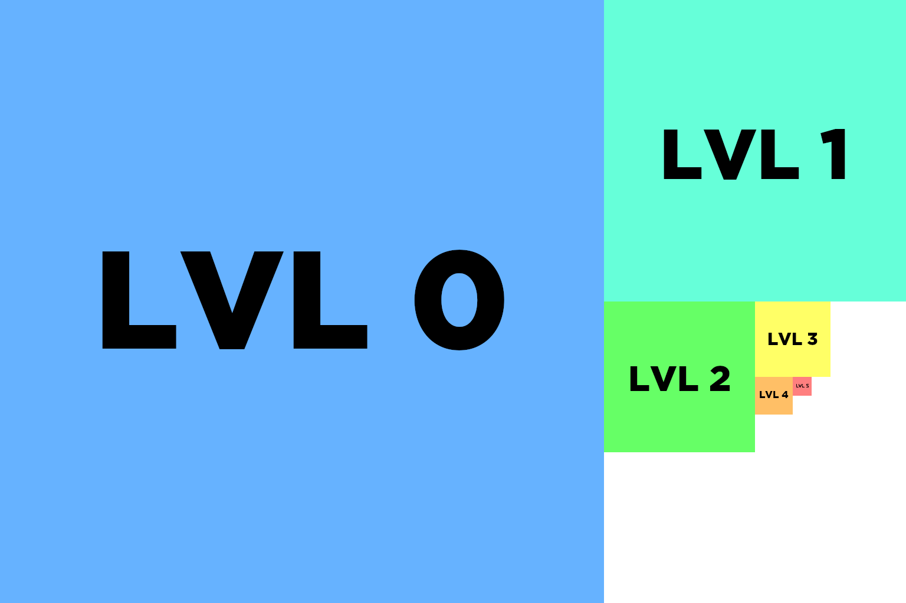

# Textures

## Encapsulation de la caméra

Dans l'exemple sur les transformations et les matrices, on utilisait une caméra orbitale. La classe `OrbitCamera` ([OrbitCamera.hpp](../inf2705/OrbitCamera.hpp)) encapsule cette fonctionnalité en gérant les touches de clavier et les mouvements de souris.

## Textures de la boîte de carton (cube)

On a cube qui ressemble à une boîte en carton et un autre cube aplati et étiré qui ressemble à un bout de route. Ce sont deux maillages différents car ils utilisent des coordonnées de texture assez différentes. Les coordonnées de texture en *s*,*t* pour la boîte de carton ont l'air de ceci :

La boîte a deux textures qui sont superposées manuellement dans le nuanceur de fragments ([composite_frag.glsl](composite_frag.glsl)). [box_bg.png](box_bg.png) est une texture de carton et [box_text.png](box_text.png) est du texte sur fond transparent.

## Texture de la route (cube aplati)

La route a une texture ([asphalt.png](asphalt.png)) qui est chargée avec répétition. Dans le `init`, on peut expérimenter avec les différents modes de dépassement. Les coordonnées de texture ont l'air de ceci (les faces minces sont moins importantes) :

On a aussi une série d'images [lvl0.png](lvl0.png) à [lvl5.png](lvl5.png) qui servent à illustrer le comportement des Mipmap. Chaque niveau est une texture deux fois plus petite que le niveau précédent et sont chargés manuellement à leur niveau de Mipmap correspondant. Si on les met ensemble pour comparer les tailles, ça a l'air de ceci :

## Contrôles

* R : réinitialiser la position de la caméra.
* \+ et - :  rapprocher et éloigner la caméra orbitale.
* haut/bas : changer la latitude de la caméra orbitale.
* gauche/droite : changer la longitude ou le roulement (avec shift) de la caméra orbitale.
* clic central (cliquer la roulette) : bouger la caméra en glissant la souris.
* roulette : rapprocher et éloigner la caméra orbitale.
* 1 : Boîte en carton avec du texte compositionné.
* 2 : Exemple de route avec texture qui se répète.
* 3 : Exemple de Mipmap manuel.
