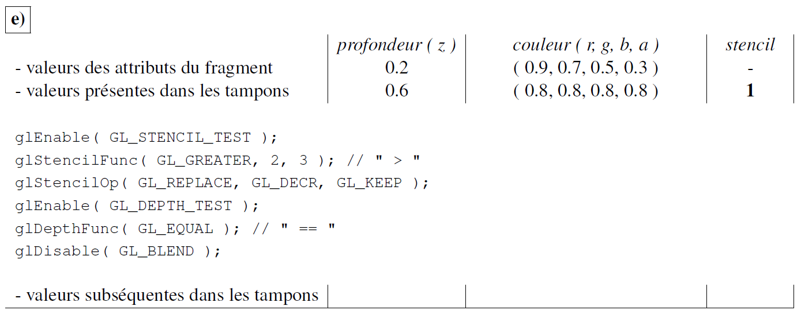

# Tampons de couleurs, profondeur et stencil

Un exercice intéressant à faire pour tester sa compréhension des opérations sur les fragments est de faire les calculs manuellement pour les tampons de couleurs, de profondeur et de stencil selon une configuration donnée. Le code du présent exemple sert à simuler de tels calculs pour un seul fragment. De cette façon, on peut vérifier facilement nos calculs avec ce qui serait fait par OpenGL.

La fonction `runTest` prend en paramètre le nom du test (une string), les valeurs des attributs du fragment courant et les valeurs présentes dans les différents tampons (profondeur, couleur, stencil), puis une fonction contenant les énoncés OpenGL qui configurent les opérations. La fonction simule le cas donné et affiche ces données et les résultats.

Par exemple, voici une question d'examen, le code pour la simuler et la sortie obtenue :



```c++
runTest("e",
    {0.2, {0.9, 0.7, 0.5, 0.3}, 0},
    {0.6, {0.8, 0.8, 0.8, 0.8}, 1},
    []() {
        glEnable(GL_STENCIL_TEST);
        glStencilFunc(GL_GREATER, 2, 3);
        glStencilOp(GL_REPLACE, GL_DECR, GL_KEEP);
        glEnable(GL_DEPTH_TEST);
        glDepthFunc(GL_EQUAL);
        glDisable(GL_BLEND);
    }
);
```

```
e)
             Z  |    Color Buffer     | Stencil
----------------+---------------------+----------
  frag     0.20 | 0.90 0.70 0.50 0.30 |   0
  init     0.60 | 0.80 0.80 0.80 0.80 |   1
  result   0.60 | 0.80 0.80 0.80 0.80 |   0
```

Les situations dans l'exemple sont prises de la [deuxième question de l'intra hiver 2018](doc/intra_h18_q2.pdf).

