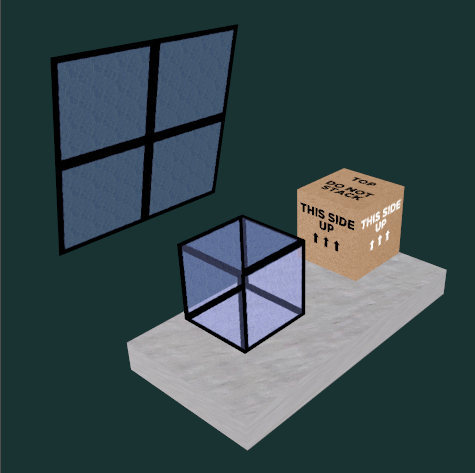
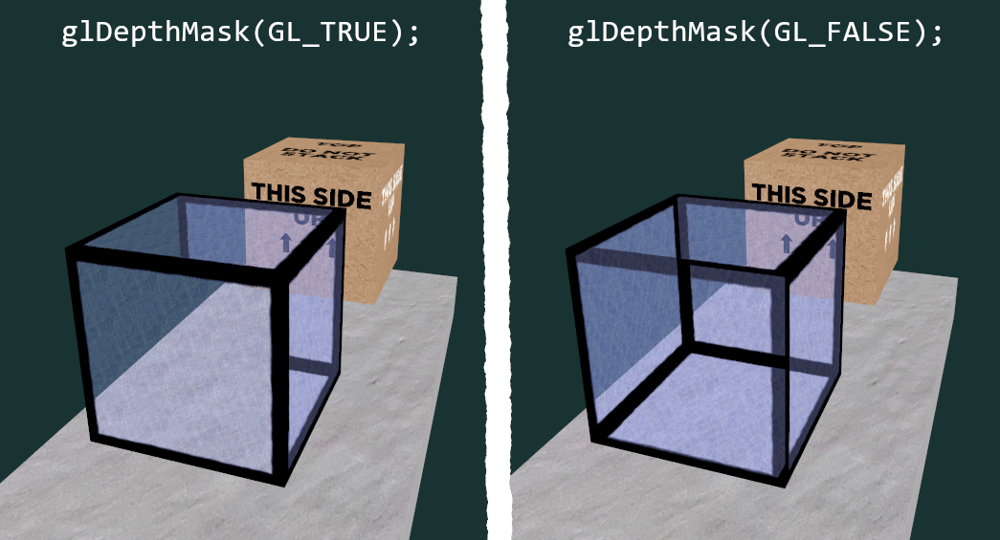
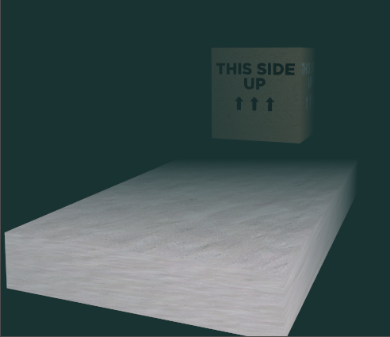

# Opérations sur les fragments - profondeur et fusion de couleurs

## Encapsulation des textures

Pour simplifier le code, on a emballé le chargement et la liaison des textures dans la classe `Texture` ([Texture.hpp](../inf2705/Texture.hpp)). Pour charger une texture à partir d'un fichier, on fait :

```c++
// 2e argument est le niveau de mipmap automatique.
Texture maTexture = Texture::loadFromFile("la_texture.png", 5);
```

Pour s'en servir, on la lie à une unité de texture active :

```c++
// L'équivalent de 
//   glActiveTexture(GL_TEXTURE13);
//   glBindTexture(GL_TEXTURE_2D, maTexture.id);
maTexture.bindToTextureUnit(13);
```

## Fusions de couleurs et textures semi-transparentes

La scène contient un bloc aplati, une boîte texturée, un bloc semi-transparent et un carré semi-transparent. La semi-transparence est donnée par une texture ([window.png](window.png)) dont le canal alpha n'est pas entièrement à 1.



On peut observer dans cette scène un vieux problème avec le dessin d'objet semi-transparent. Il faut faire attention à la manipulation du tampon de profondeur et de l'ordre d'affichage des objets. Si on dessine en appliquant le test de profondeur (avec écriture dans le tampon) comme d'habitude, on obtient un drôle d'affichage où certaines faces translucides cachent d'autres faces translucides, mais sans cacher les autres objets opaques. En effet, les primitives plus proches de la caméra vont écrire dans le tampon de profondeur et donc cacher les primitives qui sont derrière. Cette approche a du sens avec des primitives opaques, mais les primitives semi-transparentes doivent se mélanger avec ce qu'il y a derrière, mais sans les cacher, d'où la fusion de couleurs avec `glEnable(GL_BLEND)`.

La solution classique est de dessiner les objets opaques en premier avec *z-test* (`glEnable(GL_DEPTH_TEST)`) et écriture dans le tampon (`glDepthMask(GL_TRUE)`). On fait ensuite le dessin des objets translucides en désactivant l'écriture dans le tampon (`glDepthMask(GL_FALSE)`). Dans l'image ci-dessous, on voit la différence entre le test de profondeur avec ou sans écriture au traçage du cube de vitre (les deux blocs opaques restent dessinés normalement).



Le *z-test* en lecture seule règle partiellement le problème, mais il y a encore des aberrations où certaines faces semblent être devant alors qu'elles sont derrière. Il n'y a pas de façon magique de régler ce problème juste en manipulant le tampon de profondeur. Il faut soit changer l'ordre d'affichage dynamiquement (coûteux pour les scènes avec beaucoup d'objets) ou appliquer un algorithme plus avancé comme la transparence avec poids ou un tampon de profondeur auxiliaire. De nos jours, la tendance est définitivement vers le *ray-tracing* (pas matière à INF2705) pour gérer les problèmes de transparence/réflexion/réfraction.

## Effet de brouillard un peu *vieux jeu*

Pour limiter la distance de rendu et en cacher les effets, beaucoup de vieux jeux vidéos appliquaient un brouillard graduel. Un tel brouillard est plus épais (opaque) selon la distance à la caméra. Le premier *Silent Hill* est un cas assez « flagrant » si on peut dire. Une façon simple est de faire un fondu entre la couleur attendue du fragment et la couleur de fond. On fait ce fondu avec une interpolation linéaire selon la distance (voir [fog_vert.glsl](fog_vert.glsl) et [fog_frag.glsl](fog_frag.glsl)). On pourrait étendre ce concept en faisant l'interpolation avec un *skybox* échantillonné plutôt qu'une couleur de fond.



## Contrôles

* R : réinitialiser la position de la caméra.
* \+ et - :  rapprocher et éloigner la caméra orbitale.
* haut/bas : changer la latitude de la caméra orbitale.
* gauche/droite : changer la longitude ou le roulement (avec shift) de la caméra orbitale.
* clic central (cliquer la roulette) : bouger la caméra en glissant la souris.
* roulette : rapprocher et éloigner la caméra orbitale.
* 1 : activer/désactiver le carré de vitre.
* 2 : activer/désactiver le cube de vitre.
* 3 : activer/désactiver le brouillard.
* Z, X : rapprocher/éloigner la distance du début du fondu du brouillard.
* C, V : rapprocher/éloigner la distance du début du brouillard total.
* B : réinitialiser les limites du brouillard.

