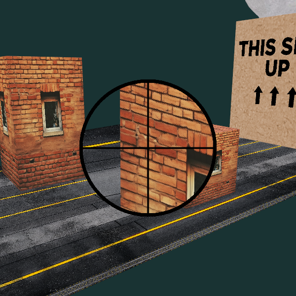
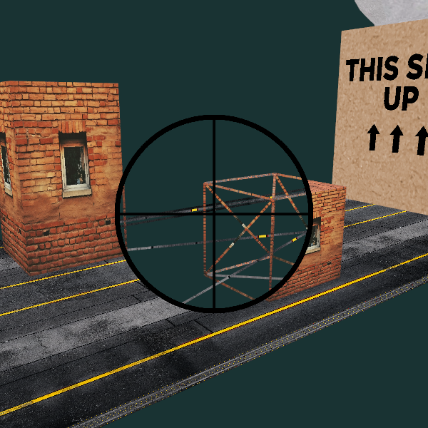
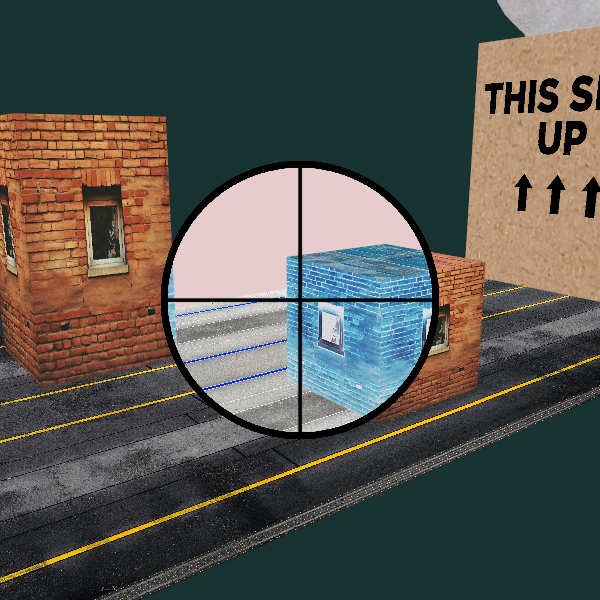

# Opérations sur les fragments - utilisation du stencil

## Lunette de visée avec effets

On a une genre de lunette de visée qui permet d'appliquer plusieurs effets à l'intérieur de son cercle sur l'écran.

À titre d'exemple, on fait du grossissement (*zoom*), traçage en fil de fer (*wireframe*) et filtre négatif. On pourrait faire n'importe quoi dans cette lunette, vu qu'on dessine la scène au complet deux fois avec des configurations différentes, mais en appliquant un test de stencil pour limiter leur zone dans la fenêtre.

Résumé des opérations pour afficher un réticule dans une lunette qui applique un effet quelconque sur la scène :
1. Dessiner le masque de la lunette (cercle blanc) en mettant seulement à jour le tampon de stencil, mais pas le tampon de couleur. On désactive aussi le test et l'écriture dans le tampon de profondeur et on n'utilise pas les matrices de visualisation ou de projection.
1. Dessiner la scène alternative (avec grossissement, wireframe, négatif) en activant le test de stencil mais sans modifier le tampon de stencil. On teste pour la valeur 1 (celle écrite par le cercle blanc précédent).
1. Dessiner la scène régulière en appliquant le test de stencil, mais en testant pour des 0.
1. Dessiner le réticule (cercle avec croix) sans test de stencil, sans écriture ou test de profondeur, et sans matrices de visualisation ou de projection.

## Contrôles

* F5 : capture d'écran.
* R : réinitialiser la position de la caméra.
* \+ et - :  rapprocher et éloigner la caméra orbitale.
* haut/bas : changer la latitude de la caméra orbitale.
* gauche/droite : changer la longitude ou le roulement (avec shift) de la caméra orbitale.
* clic central (cliquer la roulette) : bouger la caméra en glissant la souris.
* roulette : rapprocher et éloigner la caméra orbitale.
* 1 : afficher la lunette
* 2 : wireframe à travers la lunette
* 3 : filtre négatif à travers la lunette
* Z : zoom out dans la lunette
* X : zoom in dans la lunette
