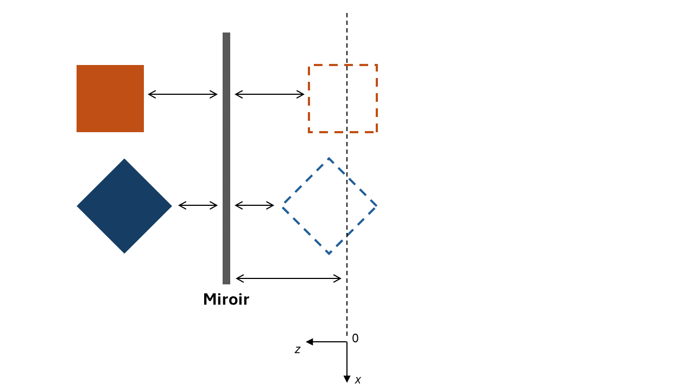
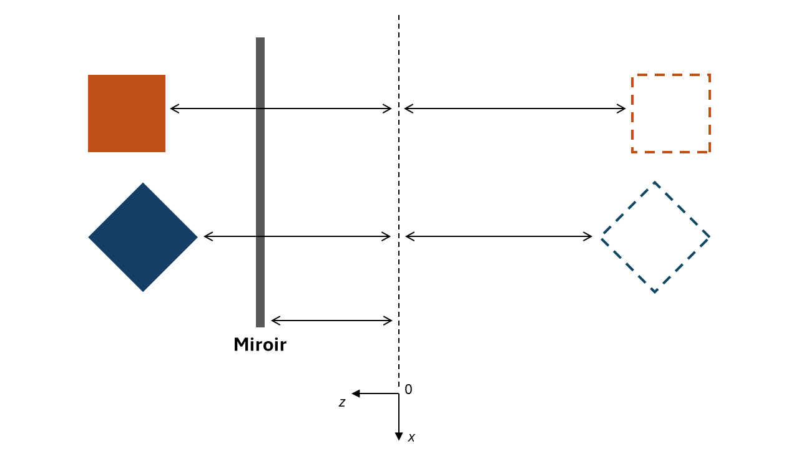

# Utilisation du stencil - miroir

La fonction `drawScene` trace la scène normalement, sans se préoccuper de tout le reste. Ça dessine le cadre du miroir, mais pas la surface du miroir lui-même.

`drawMirrorSurface` dessine la surface (texturée ou pas, au choix) du miroir, qui est juste un quad.

`drawReflectedScene` applique la transformation (vue plus loin) nécessaire à la réflexion puis appelle `drawScene` pour dessiner la scène avec une matrice de modélisation modifiée.

## Étapes

1. Remplir le stencil avec la valeur 1 pour la surface du miroir. Pour y arriver, on configure le test de stencil pour qu'il ne réussisse jamais tout en remplissant le stencil de 1.
1. Dessiner la scène réfléchie, mais seulement dans la région du miroir. On applique la transformation (matrice modélisation) pour appliquer la réflexion et on active le test de stencil pour ne garder que ce qui est visible dans la zone du miroir.
1. Dessiner la surface visible du miroir (avec la texture de vitre rayée).
1. Dessiner la scène normalement.

## Transformations de la scène réfléchie

Lorsqu'on dessine la scène réfléchie, il faut inverser la scène dans l'axe des *z*, car notre miroir est dans le plan *xy*. Or, notre miroir n'est pas nécessairement à *z*=0 (on peut le déplacer avec le clavier). On ne peut donc pas juste faire un `model.scale({0, 0, -1})` pour inverser en z. Il faut d'abord déplacer l'origine pour que le miroir soit à *z*=0, faire le *scale* négatif puis remettre l'origine à son ancienne position (avec la translation inverse).

En effet, on veut que les réflexions des objets semblent être à la même distance que les objets réels. Par exemple, si on a un miroir orienté vers les *z* positifs et avec une certaine position en *z*, nos réflexions (en pointillés) des objets (couleurs solides) auraient l'air de ceci :

Cependant, si on fait seulement le *scale* pour la réflexion, les positions seront renversées par rapport à l'axe des *z*, pas le miroir :

## Contrôles

* F5 : capture d'écran.
* R : réinitialiser la position de la caméra.
* \+ et - :  rapprocher et éloigner la caméra orbitale.
* haut/bas : changer la latitude de la caméra orbitale.
* gauche/droite : changer la longitude ou le roulement (avec shift) de la caméra orbitale.
* clic droit ou central : bouger la caméra en glissant la souris.
* roulette : rapprocher et éloigner la caméra orbitale.
* 1 : activer/désactiver l'illustration de la zone affectée par le stencil.
* 2 : activer/désactiver la scène normale (pas réfléchie dans le miroir).
* 3 : activer/désactiver la texture de vitre du miroir.
* W et S : bouger le miroir en Z.
* A et D : bouger le miroir en X.
