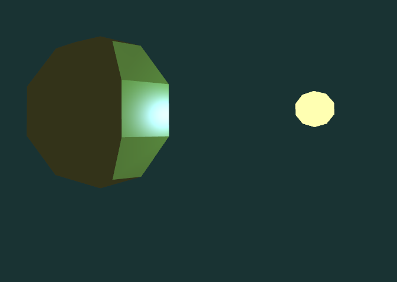

# Illumination

## Encapsulation des variables et blocs uniformes

Dans cet exemple, on passe les données de matériau et de source lumineuse uniformément. Ça ferait beaucoup de variables uniformes. On va plutôt les passer dans des blocs uniformes, à l'aide de *uniform buffer objects* (UBO). Ceux-ci fonctionnent comme un mélange de variables uniformes et de VBO. Les détails ne sont pas importants, on les a encapsulés dans la classe `UniformBlock` (dans le fichier [ShaderProgram.hpp](../inf2705/ShaderProgram.hpp))

```c++
// Une struct qui aura son équivalent dans les nuanceurs.
struct MaStruct { vec4 data1; float data2; float data3 };
// Le bloc uniforme. On passe le nom du bloc en GLSL et un index de liaison qu'on choisit.
UniformBlock<MaStruct> monBloc = {"LightSource", 42};
// Affecte les données.
monBloc = MaStruct{{1, 2, 3, 4}, 42, 69};
// Remplir le UBO avec les données. Ça fait un appel à glBufferData, comme avec les VBO.
monBloc.setup();
// Lier au bloc uniforme dans le programme GLSL.
monBloc.bindToProgram(monProgrammeNuanceur);
```

## Modèles d'illumination

Le modèle plat (*flat shading*) fait les calculs dans le nuanceur de géométrie, car on a besoin de toute la primitive. On utilise le centroïde de la primitive pour calculer les vecteurs *L* et *O* et on calcule la normale avec les côtés de la primitive. Ça donne une couleur uniforme sur la primitive.


 Dans le modèle de Gouraud, les calculs sont effectués une fois par sommet, donc dans le nuanceur de sommets. Les résultats (couleurs) sont passés en sortie des sommets et donc interpolés aux fragments. Les normales sont précalculées et incluses dans les données du maillage.


Dans le modèle de Phong, les calculs géométriques (positions, directions, normales) sont faits dans le nuanceur de sommet et interpolés aux fragments. C'est ensuite dans chaque fragment que sont effectués les calculs d'éclairage avec les vecteurs interpolés en entrée.

On peut choisir d'utiliser des normales qui sont interpolées aux sommets (lisses) ou perpendiculaires à la primitive (plates).




## Formats de normales

En sélectionnant le mode d'affichage 1, on peut voir de quoi ont l'air les normales selon le modèle lisse ou plat dans les données du maillage. Les normales plates sont tout simplement perpendiculaires à la primitive à laquelle appartient le sommet. La normale *lisse* pour un sommet est la moyenne des normales des primitives qui se croise à ce sommet.

Ces normales sont précalculées et incluses dans les données du maillage. On a donc deux maillages différents pour représenter la sphère : [sphere_flat.obj](sphere_flat.obj) et [sphere_smooth.obj](sphere_smooth.obj).


## Contrôles

* R : réinitialiser la position de la caméra.
* \+ et - : rapprocher et éloigner la caméra orbitale.
* haut/bas : changer la latitude de la caméra orbitale.
* gauche/droite : changer la longitude ou le roulement (avec shift) de la caméra orbitale.
* clic central (cliquer la roulette) : bouger la caméra en glissant la souris.
* roulette : rapprocher et éloigner la caméra orbitale.
* 1 : Démo des modèles de calcul de normales.
* 2 : Modèle plat ou flat shading (calculs par primitive).
* 3 : Modèle de Gouraud (calculs par sommet).
* 4 : Modèle de Phong (calculs par fragment).
* W et S : Bouger la lumière sur l'axe des Z.
* A et D : Tourner la sphère autour de l'axe des Y.
* N : Changer le type de normales entre *smooth* (interpolées aux sommets) et *flat* (perpendiculaire à la face).
* B : Changer la formule de calcul spéculaire entre Blinn et Phong.
* J : Activer/désactiver la réflexion ambiante.
* K : Activer/désactiver la réflexion diffuse.
* L : Activer/désactiver la réflexion spéculaire.
* U : Augmenter le nombre de bandes de cel-shading.
* I : Diminuer le nombre de bandes de cel-shading (0 = pas de cel-shading).
