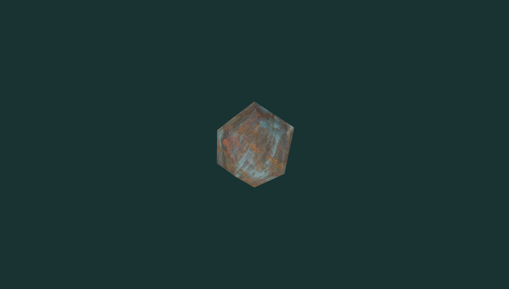
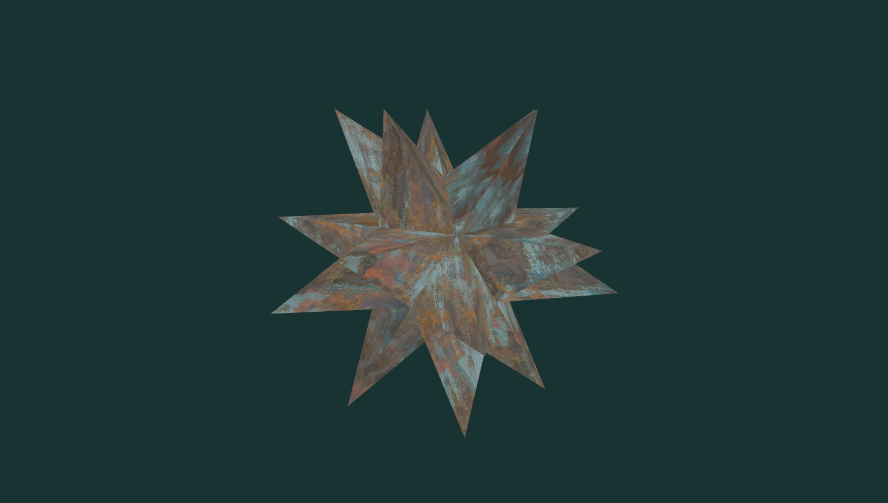
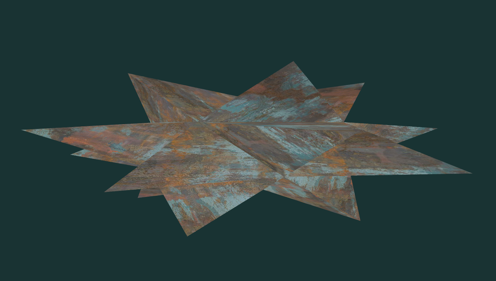
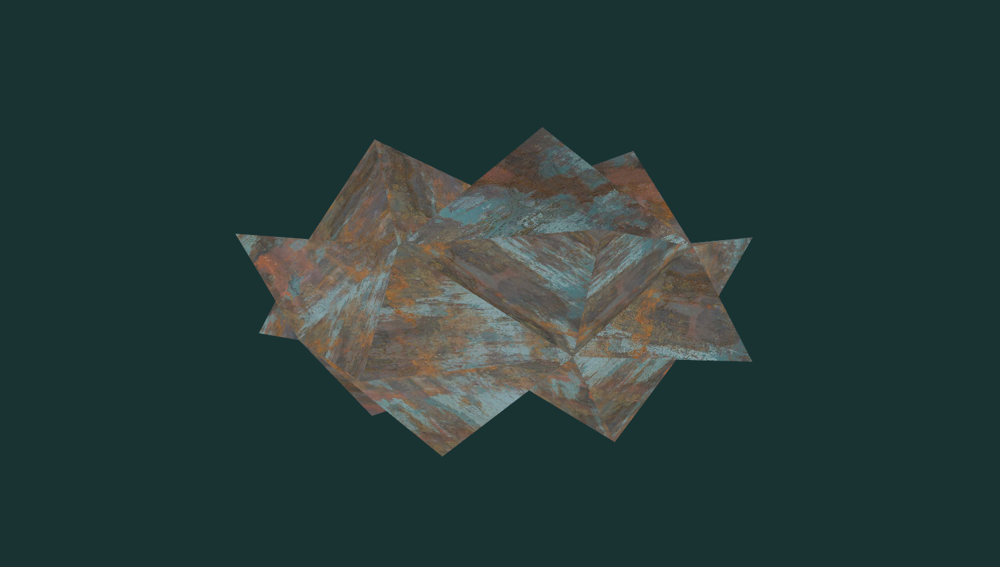

# Nuanceurs de géométrie

## Viewports

La fenêtre est séparée en deux sections. Un appel différent à `glViewport` est fait avant d'afficher chaque partie.

## Extrusion de faces

La moitié supérieur de la fenêtre montre un icosaèdre (un *d20* pour ceux qui aiment les jeux de société) texturé.

En appuyant sur U et I, on change la variable uniforme `extrudeLength`. Dans le nuanceur de géométrie ([extrude_geom.glsl](extrude_geom.glsl)), des faces sont ajoutées à la forme sous la forme de pics extrudées des faces. Le maillage de base du d20 n'inclut pas ces faces additionnelles, elles sont générées par le nuanceur de géométrie.

On modifiant la matrice de modélisation, on peut étirer le d20 verticalement (en *y*) et horizontalement (en *xz*). La variable `usingWorldPositions` contrôle quelles coordonnées sont utilisées (coords d'objet ou coords de scène). En utilisant les coordonnées d'objet, on applique les transformations (matrice de modélisation) comme si les pics extrudés faisaient partie de la forme d'origine. En utilisant les coords de scène, on extrude sur la normale des faces déjà transformées.

En utilisant les coordonnées originales d'objet :

En utilisant les coordonnées de scène :

## Lutins (*sprites*) et animation

La partie inférieure de la fenêtre montre une animation d'un personnage bien connu. Dans cette scène, on a seulement un maillage constitué d'un point. Le quadrilatère nécessaire pour montrer la texture animée est généré par le nuanceur de géométrie ([sprites_geom.glsl](sprites_geom.glsl)). La matrice de modélisation est appliquée pour modifier ses dimensions selon les proportions de la texture.

L'animation (`drawAnimatedCharacter` et `drawAnimatedSword`) est faite à partir de *spritesheets*. Un spritesheet est une vieille méthode d'animation numérique. C'est à la base une image contient plusieurs sprites (lutins). Ces sprites sont de petites images qui, ensemble, forment les trames d'une animation. Chaque sprite dans le spritesheet est placé dans une disposition régulière (horizontalement dans notre cas). On utilise ensuite un index dans le spritesheet pour afficher le sprite correct à l'écran.

## Contrôles

* R : réinitialiser la position de la caméra.
* \+ et - :  rapprocher et éloigner la caméra orbitale.
* haut/bas : changer la latitude de la caméra orbitale.
* gauche/droite : changer la longitude ou le roulement (avec shift) de la caméra orbitale.
* clic central (cliquer la roulette) : bouger la caméra en glissant la souris.
* roulette : rapprocher et éloigner la caméra orbitale.
* U : Augmenter l'extrusion.
* I : Diminuer l'extrusion.
* O : Appliquer l'extrusion sur les coordonnées de scène ou d'objet.
* W et S : Étirer/compresser le d20 en Y.
* A et D : Étirer/compresser le d20 en XZ.
* Espace : Coup d'épée (début d'animation).
