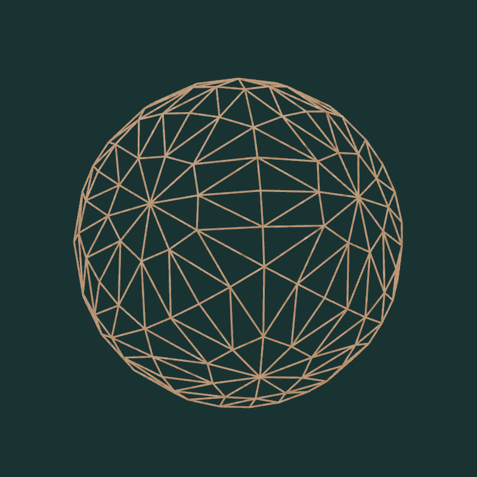
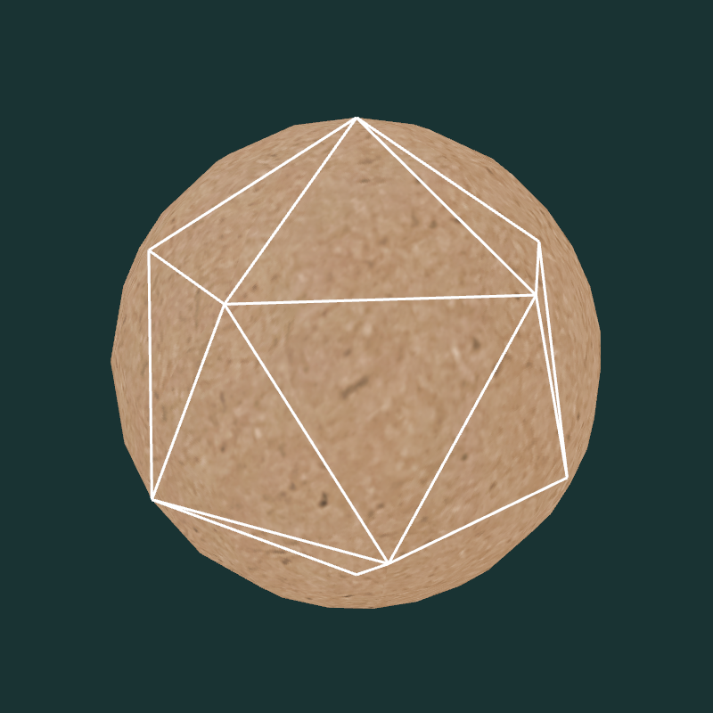

# Nuanceurs de tesselation

## Forme de base et subdivision

On a à la base un icosaèdre (*d20*) régulier, c'est-à-dire dont tous les sommets ont une distance de 1 par rapport à l'origine.

Les nuanceurs de tesselation le transforment en sphère en subdivisant ses faces et en repositionnant les sommets créés.

La forme (en fil de fer) générée par 4 niveaux de tesselation :

La même forme texturée par rapport au mesh de base :

## Repositionnement des sommets

Dans le nuanceur d'évaluation de la tesselation, n veut créer une sphère, mais on ne connait pas son rayon. Assumer rayon=1 est une mauvaise idée. On pourrait le mettre en variable uniforme, mais c'est mieux de tout simplement calculer le rayon local à la primitive courante (celle qui génère le sommet tessélé). Ça permet aussi de garder une géométrie sur laquelle on peut par la suite appliquer une matrice de modélisation (avec étirement, déplacement, etc.).

Dans [sphere_tesseval.glsl](sphere_tesseval.glsl), on fait la moyenne pondérée (avec les `gl_TessCoord`) pour trouver la position moyenne du nouveau sommet. On normalise ensuite ce vecteur, ce qui nous donne la direction du nouveau sommet par rapport à l'origine. On multiplie ce vecteur par la moyenne pondérée des rayons des trois sommets de la primitive et ça le repositionne sur la surface sphérique locale.

## Contrôles

* R : réinitialiser la position de la caméra.
* \+ et - :  rapprocher et éloigner la caméra orbitale.
* haut/bas : changer la latitude de la caméra orbitale.
* gauche/droite : changer la longitude ou le roulement (avec shift) de la caméra orbitale.
* clic central (cliquer la roulette) : bouger la caméra en glissant la souris.
* roulette : rapprocher et éloigner la caméra orbitale.
* Z : Afficher en faces pleines ou wireframe.
* X : Montrer ou cacher les arêtes de la forme originale (avant tessellation).
* C : Activer/désactiver le cull des faces arrières.
* W et S : Étirer/compresser le d20 en *y*.
* A et D : Étirer/compresser le d20 en *xz*.
