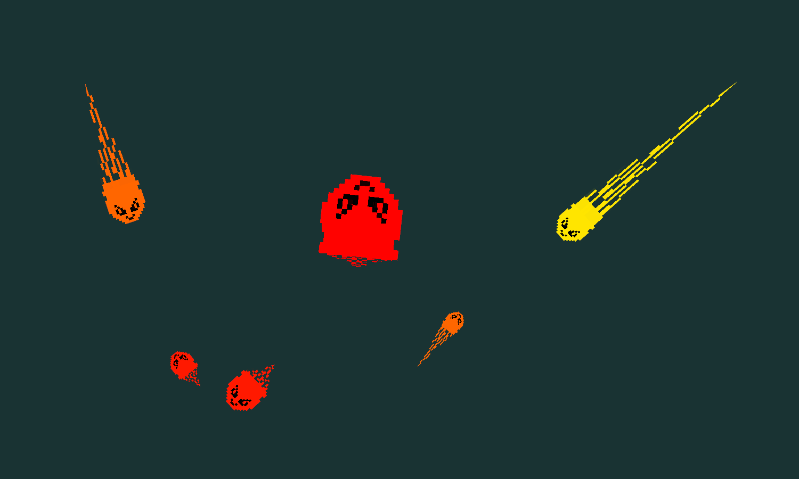

# Rétroaction avec TFO et VBO

On a dans cette scène 2D un nuage de particules sur lesquelles est appliquée de la physique cinétique. Les particules ont une vitesse et un champ de force (contrôlé par la souris) est appliqué pour les bouger. Les calculs de physique sont appliqués à chaque particule à chaque trame.

Chaque particule (classe `Particle`) a une position dans l'espace, une vitesse actuelle et une masse. Elle est affichée avec un lutin (un *sprite*) et une trainée. Une plus grande masse rend une particule plus grosse à l'écran et une plus grande vitesse lui donne une couleur plus jaune ainsi qu'une trainée plus longue.

## Parallélisme des calculs sur GPU

Le nuage peut contenir des millions de particules (quantité contrôlée par la variable `numParticles`). Ces millions de calculs seraient difficiles à faire sur le CPU qui a peut-être une douzaine de coeurs tout en gardant 30 ou 60 trames par secondes. Cependant, on peut exploiter le parallélisme fourni par le GPU qui lui a des milliers de coeurs. De plus, ces coeurs sont optimisés pour les opérations matricielles et vectorielles (utiles pour faire de la physique).

## Affichage des particules

Le nuanceur de géométrie ([particles_draw_geom.glsl](particles_draw_geom.glsl)) génère les sommets d'un carré qui affichera un lutin avec une trainée à partir des données cinétiques des particules. En effet, c'est plus simple que de mettre à jour un maillage préchargé avec les polygones complets à chaque trame. De cette façon, les seules données qui transigent entre les nuanceurs sont les propriétés physiques, pas géométriques.

## Étapes

Avant la première trame (dans `init`) :

1. Générer aléatoirement l'état initial des particules.
1. Créer deux VAO, un pour le calcul et un pour l'affichage. Voir commentaire dans le code.
1. Créer deux VBO. Ils agiront en double buffer, un peu comme les tampons de fenêtre d'OpenGL.
1. Créer une requête et un *transform feedback object* (TFO). C'est ce qui nous permet de passer les données en mémoire graphique et principale.
1. Remplir le VBO d'entrée avec l'état initial des particules.

À chaque trame (dans `drawFrame`) :

1. Exécuter le pipeline de calcul (donc le programme qui a seulement [particles_compute_vert.glsl](particles_compute_vert.glsl)). Un VBO est utilisé comme valeurs de calculs (les attributs passés en entrée au nuanceur) et l'autre pour contenir les résultats (les variables de sortie du nuanceur).
1. Échanger les deux VBO. Les résultats de calcul sont utilisés en données d'entrée au programme d'affichage.
1. Dessiner les particules. La majorité du travail est fait par le nuanceur de géométrie ([particles_draw_geom.glsl](particles_draw_geom.glsl)).
1. Si sauvegarde requise (touche F), faire la requête pour rapatrier les données sur le CPU et prendre une capture d'écran. Les données des particules sont enregistrées dans un fichier CSV.

## Contrôles

* R : réinitialiser la position de la caméra.
* flèches : bouger la caméra dans le plan XY.
* roulette de souris : zoom in/out.
* clic gauche : appliquer un champ attractif sur le curseur de la souris.
* clic droit : appliquer un champ répulsif sur le curseur de la souris.
* espace : freiner les particules.
* F : sauvegarder les données de particules dans un fichier CSV en plus d'un screenshot.

